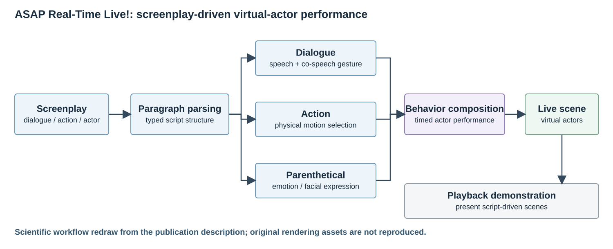

# ASAP: Auto-generating Storyboard and Previz

**Hanseob Kim, Ghazanfar Ali, Bin Han, Hwangyoun Kim, Jieun Kim, Jae-In Hwang**

**SIGGRAPH Asia Real-Time Live! · 2022** · Published

[Paper / publisher](https://doi.org/10.1145/3550453.3570124) · [Project page](https://ghazanfarali.com/research/asap-live/) · [Video presentation](https://www.youtube.com/watch?v=omdEg7Ro_bU) · [BibTeX](citation.bib) · [Requirements](REQUIREMENTS.md) · [Code & setup](#implementation-and-usage)

> A live demonstration of screenplay-driven virtual actors.



*Graphical abstract diagram. Screenplay structure drives coordinated virtual-actor behavior and previsualization.*

## Why this research

A live workflow demonstrates how screenplay text can become visible actor behavior. This presentation shows the ASAP system coordinating dialogue, emotion and physical action during previsualization.

The SIGGRAPH Asia Real-Time Live! presentation shows ASAP turning screenplay text into virtual-actor scenes. Dialogue drives co-speech gesture, parentheticals supply emotional cues, and action paragraphs specify physical movements. The video is the live demonstration of this system.

## Method at a glance

**Movie script** → **Gesture + expression + action** → **Live virtual-actor scene**

| | Research system |
|---|---|
| Input | Movie-script dialogue, parentheticals, and action paragraphs |
| Method | Script understanding and composition of animation modules |
| Output | Virtual-actor scenes, gestures, facial expression, and body movements |

## Evidence and scope

Real-Time Live! demonstration; no journal benchmark is attributed to this item

**Attribution:** These findings describe the paper or manuscript, not results obtained with this repository's code.

**Study context:** Demonstration scenarios.

**Limitations:** This demonstration and its one-page publication are distinct from the ISMAR and journal papers.

## Explore the implementation

A standalone autoplay previsualization demo. It uses disclosed shared-architecture choices from the journal and does not recreate the original live performance or Unity assets.

This repository contains independently written research code. The institute's original source, datasets and trained models are not distributed. Public-data preparation, commands, assumptions and checks are documented below and in [REQUIREMENTS.md](REQUIREMENTS.md).

## Resources and citation

Read the paper through its [publisher record](https://doi.org/10.1145/3550453.3570124). PDFs are hosted by publishers or preprint archives rather than stored in this repository.

Watch the [existing YouTube presentation](https://www.youtube.com/watch?v=omdEg7Ro_bU).

Please cite the research paper when using its ideas; [download the BibTeX citation](citation.bib). The implementation has its own documented scope.

## Implementation and usage

<!-- implementation-guide -->

This standalone, asset-free demonstrator compiles a screenplay into an auto-playing browser scene. Dialogue triggers estimated speech timing, gaze, and a catalog gesture; parentheticals trigger emotion; action paragraphs create movement toward a configured prop anchor followed by an interaction.

**Citation.** Hanseob Kim, Ghazanfar Ali, Bin Han, Hwangyoun Kim, Jieun Kim, and Jae-In Hwang. “ASAP: Auto-generating Storyboard and Previz.” *SIGGRAPH Asia Real-Time Live!* (2022), pp. 1–1. [https://doi.org/10.1145/3550453.3570124](https://doi.org/10.1145/3550453.3570124). Status: published live demonstration.

Only the abstract and public metadata were available locally for this variant. See [REQUIREMENTS.md](REQUIREMENTS.md) for the evidence boundary. No institute code, datasets, models, weights, mocap, character assets, or Unity project are included.

### Run the included example

```powershell
python -m venv .venv
.venv\Scripts\Activate.ps1
python -m pip install -e .
python scripts/smoke.py
start outputs/smoke/live.html
```

The default backend is a deterministic TF-IDF cosine baseline. To use a cached sentence-transformer, install `python -m pip install -e ".[semantic]"` and add `"resolver": {"backend": "sentence-transformer", "model": "path-or-cached-model-name"}` to the library. `local_files_only=True` prevents downloads.

### Input schemas

Structured text uses one `LABEL: text` record per line. Supported labels are `SCENE`, `ACTION`, `CHARACTER`, `DIALOGUE`, and `PARENTHETICAL`. FDX input reads `Paragraph Type` plus nested `Text` elements. The library JSON contains `stage`, keyed `characters`, keyed `props` with interaction anchors, and `motions` whose entries include `id`, `kind`, and example `phrases`.

`timeline.json` is the canonical output. `live.html` embeds its JSON, CSS, SVG, and JavaScript, and opens without a server. It is a schematic playback demo, not the paper's Unity rendering or trained text-to-gesture system.

### Public data and model setup

The included screenplay and motion library are authored artificial fixtures, not paper data. Use screenplays you own or public-domain scripts and motion descriptions you can redistribute. Keep user downloads under ignored asset/data/model directories.

To swap in real inputs, keep the same labels in the screenplay (or use an `.fdx` file) and the same keys in `library.json`, then run `asap-live path/to/screenplay.fdx --library path/to/library.json --out outputs/my-run`. The smoke script and CLI call the same parser, compiler, and renderer.

See [REQUIREMENTS.md](REQUIREMENTS.md) for paper facts, implementation assumptions, and scope limits.
