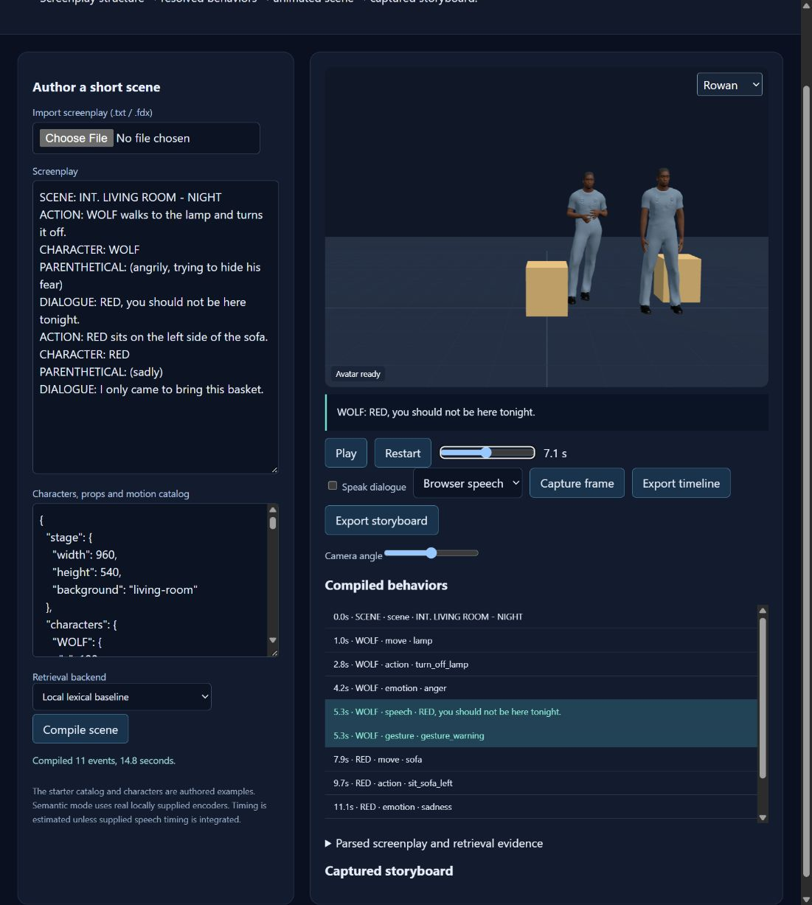

# ASAP: Auto-generating Storyboard and Previz

**Hanseob Kim, Ghazanfar Ali, Bin Han, Hwangyoun Kim, Jieun Kim, Jae-In Hwang**

**SIGGRAPH Asia Real-Time Live! · 2022** · Published

[Paper / publisher](https://doi.org/10.1145/3550453.3570124) · [Project page](https://ghazanfarali.com/research/asap-live/) · [Video presentation](https://www.youtube.com/watch?v=omdEg7Ro_bU) · [BibTeX](citation.bib) · [Requirements](REQUIREMENTS.md) · [Code & setup](#implementation-and-usage)

> A live demonstration of screenplay-driven virtual actors.


*Graphical abstract diagram. Screenplay structure drives coordinated virtual-actor behavior and previsualization.*

## Why this research

A live workflow demonstrates how screenplay text can become visible actor behavior. This presentation shows the ASAP system coordinating dialogue, emotion and physical action during previsualization.

The SIGGRAPH Asia Real-Time Live! presentation shows ASAP turning screenplay text into virtual-actor scenes. Dialogue drives co-speech gesture, parentheticals supply emotional cues, and action paragraphs specify physical movements. The video is the live demonstration of this system.

## Method at a glance

**Movie script** → **Gesture + expression + action** → **Live virtual-actor scene**

| | Research system |
|---|---|
| Input | Movie-script dialogue, parentheticals, and action paragraphs |
| Method | Script understanding and composition of animation modules |
| Output | Virtual-actor scenes, gestures, facial expression, and body movements |

## Evidence and scope

Real-Time Live! demonstration; no journal benchmark is attributed to this item

**Attribution:** These findings describe the paper or manuscript, not results obtained with this repository's code.

**Study context:** Demonstration scenarios.

**Limitations:** This demonstration and its one-page publication are distinct from the ISMAR and journal papers.

## Explore the implementation

A standalone autoplay previsualization demo whose co-speech gesture uses wild-pose matching with multilingual support, as in the authors' project lineage, with per-line source language. It uses disclosed shared-architecture choices from the journal and does not recreate the original live performance or Unity assets.

This repository contains independently written research code. The institute's original source, datasets and trained models are not distributed. Public-data preparation, commands, assumptions and checks are documented below and in [REQUIREMENTS.md](REQUIREMENTS.md).

## Resources and citation

Read the paper through its [publisher record](https://doi.org/10.1145/3550453.3570124). PDFs are hosted by publishers or preprint archives rather than stored in this repository.

Watch the [existing YouTube presentation](https://www.youtube.com/watch?v=omdEg7Ro_bU).

Please cite the research paper when using its ideas; [download the BibTeX citation](citation.bib). The implementation has its own documented scope.

<!-- demo-preview:start -->
## Demo preview



*Local demo with small starter examples; the capture illustrates the interface, not a reproduced paper benchmark.*

From the repository root, using the Python environment described below:

```sh
python -m pip install -e .
python -m pip install -r scripts/requirements-demo.txt
python scripts/start_demo.py
```

Open **http://127.0.0.1:8080/**. The starter screenplay loads into the live scene and plays automatically. Use **Play / pause**; pick a **Camera** preset or the auto-cut camera track, **Record video** to save a WebM of the stage, and **Capture frame** to build the storyboard, which exports as HTML or JSON. The VR button offers an immersive view when the browser supports WebXR (not tested on headset hardware). Camera presets, recording and the VR view come from the later ASAP journal paper; the Real-Time Live! paper does not describe them, so they are web-demo extras here. The launcher prepares pinned Three.js modules and downloads one small official BEAT BVH/TextGrid sample on first run. It builds a nine-clip local bank and fits the multilingual wild-pose matching adapter under ignored `outputs/beat-library/`; later runs reuse the cache. The first run needs internet access. Original recordings, large datasets, institute assets, and pretrained gesture weights are not distributed.

The 3D presentation uses shared Three.js avatar components and bundled fictional CC0 characters. The paper-specific algorithms and data adapters live in this repository.

The application uses `multilingual` retrieval for recorded co-speech motion: the wild-pose matching model with multilingual support, which the live demonstration used according to the authors' project lineage. Each dialogue line sends its `source_language`; non-English lines need an explicit English translation in `examples/beat-translations.json`, which covers the bundled Korean example (`examples/screenplay-ko.txt`). The screenplay parser, action resolver, live scene playback, and capture remain this application's core. The BEAT preparation and retrieval dependencies are vendored in this repository, so no sibling repository checkout is needed. See `scripts/prepare_beat_demo.py` to rebuild the ignored local bank.

<!-- demo-preview:end -->

## Implementation and usage

<!-- implementation-guide -->

This standalone, asset-free demonstrator compiles a screenplay into an auto-playing browser scene. Dialogue triggers estimated speech timing, gaze, and recorded co-speech gesture from wild-pose matching with multilingual support; parentheticals trigger emotion; action paragraphs create movement toward a configured prop anchor followed by an interaction.

**Citation.** Hanseob Kim, Ghazanfar Ali, Bin Han, Hwangyoun Kim, Jieun Kim, and Jae-In Hwang. “ASAP: Auto-generating Storyboard and Previz.” *SIGGRAPH Asia Real-Time Live!* (2022), pp. 1–1. [https://doi.org/10.1145/3550453.3570124](https://doi.org/10.1145/3550453.3570124). Status: published live demonstration.

Only the abstract and public metadata were available locally for this variant. See [REQUIREMENTS.md](REQUIREMENTS.md) for the evidence boundary. No institute code, datasets, models, weights, mocap, character assets, or Unity project are included.

### Interactive quickstart

From this repository root, install the package, prepare the local viewer, and launch the browser demo:

```powershell
python -m pip install -e .
python scripts/prepare_viewer.py
python scripts/demo.py --port 8010
```

Open http://127.0.0.1:8010. The authored example compiles on load and plays automatically. Choose **Korean dialogue** under **Starter screenplay** for the multilingual example; edit the screenplay or import an FDX file, then play or scrub the timeline.

### Verify the included example

```powershell
python -m venv .venv
.venv\Scripts\Activate.ps1
python -m pip install -e .
python scripts/verify.py
start outputs/verify/live.html
```

The default backend is offline and deterministic: stemmed TF-IDF cosine for action combinations and stemmed keyword matching for emotions. For Sentence-BERT matching, see [Local Sentence-BERT models](#local-sentence-bert-models).

### Input schemas

Structured text uses one `LABEL: text` record per line. Supported labels are `SCENE`, `ACTION`, `CHARACTER`, `DIALOGUE`, and `PARENTHETICAL`. FDX input reads `Paragraph Type` plus nested `Text` elements. An optional `LANGUAGE: ko` line sets the language of the dialogue that follows. The library JSON contains `stage`, keyed `characters` (optional `aliases` and `language`), keyed `props` (instances with stand points, interaction points and sizes), and `actions`, the plausible combination dictionary described below. Older catalogs that list combinations under `motions` with `"kind": "action"` still load.

### Screenplay modules

These modules follow the later journal architecture; the one-page live paper does not specify them.

- **Actions.** The library's `actions` list is the plausible action–object–position dictionary. Each entry has `id`, `verb`, `object`, `position` and `phrases`, plus optional `synonyms`, `effect` and `duration`. The subject is the character name nearest the start of the sentence, before the verb. Names match case-sensitively as whole words, so "The red lamp" does not select RED. A sentence without a name uses the most recent character and is marked `subject_source: "context"`. The paragraph is compared with every combination by cosine similarity. Regular-expression hints for verbs, prop classes and positions only veto contradicting combinations and supply verb evidence. A paragraph becomes a `narration` event, with no physical action, when it lacks a plausible combination or verb evidence, or scores below `resolver.action_threshold` (0.3 lexical, 0.45 Sentence-BERT). This is the left endpoint of the journal paper's Fig. 8. A Sentence-BERT paraphrase without a lexical verb must reach `action_paraphrase_threshold` (0.7).
- **Props.** Keys in `props` are instances. `class`, or the key without a numeric suffix, names the object class, so several lamps can coexist. The nearest instance to the actor's current position is chosen. When a prop has no positional anchors, `left`/`right` choose between instances. `anchor`, or a per-position entry in `anchors`, is the stand point the actor walks to. `interaction` is the `[x, y, height_m]` hand target, `size` is `[width, height, depth]` in metres, and `seat_height` is used for sitting. Without an anchor, the stand point is derived from the prop size plus 0.35 m clearance. An optional `state` (`on`/`off`, `open`/`closed`) is the prop's initial state, and an action's `effect` (for example `{"state": "off"}`) changes it.
- **Walking.** Each `move` event carries a `path` planned by grid A* over the stage floor (0.1 m cells, octile heuristic, 8-connected without corner cutting). Prop footprints, inflated by a 0.2 m body radius, are obstacles; the cell path is shortened by line-of-sight checks. A seat stand point inside its prop is entered from the nearest free cell. The move's duration follows the path length at 1 m/s. If no path exists, the move falls back to a straight line and records `"planner": "straight-fallback"`.
- **Emotion.** Parentheticals are scored against a keyword dictionary for anger, disgust, fear, neutral, joy, sadness and surprise; the library's `emotions` field can replace it. Each keyword implies a weak, medium or strong level. The offline path counts stemmed keyword hits. With a Sentence-BERT model, each emotion also adds its top three keyword cosine similarities above 0.25. Intensifiers such as "very" or "slightly" shift the level. Text without an emotional cue maps to neutral. Emotion events carry `emotion`, `level` (1–3) and per-emotion scores.
- **Manual expressions.** Append `[emotion: joy 2]` to any paragraph, or set `emotion_overrides` in the library, for example `{"3": {"emotion": "sadness", "level": 3}}` keyed by paragraph index. The demo's **Facial expression per paragraph** panel writes that field and recompiles.
- **Gaze.** A speaker looks at a character named in the line, otherwise at the centroid of the other characters. Speech events carry `gaze` and `gaze_point`.
- **Co-speech gesture.** Dialogue gestures are retrieved at playback from the local BEAT bank. **Export timeline** adds each speech event's played clip ids and retrieval route, plus a `played_gestures` list.
- **FDX.** Character extensions such as `(CONT'D)`, `(V.O.)` and `(O.S.)` are removed, and styled text runs are joined without inserted spaces.

### Local Sentence-BERT models

Semantic mode never downloads at compile time. Models load with `local_files_only=True`, once per server process, and embeddings are cached across compiles. The journal paper names `all-mpnet-base-v2` for gesture text and `multi-qa-mpnet-base-dot-v1` for actions; this implementation reuses `all-mpnet-base-v2` for the emotion keywords, because co-speech retrieval runs in the BEAT adapter. Save both models into the ignored `models/` folder once:

```sh
python -m pip install -e ".[semantic]"
python -c "from sentence_transformers import SentenceTransformer as S; [S('sentence-transformers/' + n).save('models/' + n) for n in ('all-mpnet-base-v2', 'multi-qa-mpnet-base-dot-v1')]"
```

In the demo, choose **Sentence-BERT** and enter `models/all-mpnet-base-v2` and `models/multi-qa-mpnet-base-dot-v1`. For the CLI, add the same folders to the library; relative paths resolve from the working directory:

```json
"resolver": {"backend": "sentence-transformer", "emotion_model": "models/all-mpnet-base-v2", "action_model": "models/multi-qa-mpnet-base-dot-v1"}
```

`timeline.json` is the canonical output. `live.html` embeds its JSON, CSS, SVG, and JavaScript, and opens without a server. It is a schematic playback demo, not the paper's Unity rendering or trained text-to-gesture system.

### Public data and model setup

The included screenplay and motion library are authored artificial fixtures, not paper data. Use screenplays you own or public-domain scripts and motion descriptions you can redistribute. Keep user downloads under ignored asset/data/model directories.

To swap in real inputs, keep the same labels in the screenplay (or use an `.fdx` file) and the same keys in `library.json`, then run `asap-live path/to/screenplay.fdx --library path/to/library.json --out outputs/my-run`. The verify script and CLI call the same parser, compiler, and renderer.

See [REQUIREMENTS.md](REQUIREMENTS.md) for paper facts, implementation assumptions, and scope limits.

## Run the interactive 3D demo

From this repository root, with Python 3.10+:

```bash
python scripts/prepare_viewer.py
python scripts/demo.py --port 8010
```

Open http://127.0.0.1:8010. Edit the screenplay or import FDX, compile the scene, play/scrub its actual event schedule, inspect resolved actions/gestures and capture rendered storyboard frames. Characters are bundled fictional CC0 avatars; the starter action catalog is authored, while dialogue retrieves locally prepared BEAT body-motion clips. The browser renderer replaces the institute’s Unity/assets; it does not reproduce its motion library.

The default lexical matching runs without model downloads; [Local Sentence-BERT models](#local-sentence-bert-models) describes semantic mode. The scene catalog remains JSON: replace `characters`, `props` and `actions` to extend the demonstration. No dataset or model weights are included.

The journal demo exposes camera inspection, JSON schedule export and storyboard export. The ISMAR variant centers on scene playback and frame capture; the Live variant starts continuous playback after compilation. Neither earlier variant claims the journal’s full VR/360 outputs.

### Previsualization extras in the browser

Camera presets, video recording and the VR view come from the later ASAP journal paper; the Real-Time Live! paper does not describe them, so they are web-demo extras here.

- **Camera presets.** Choose wide, free orbit, or a close-up, over-the-shoulder or medium shot on any character. **Auto-cut** follows a camera track derived from the compiled events: over-the-shoulder on the speaker during dialogue, a close-up for parentheticals, a medium shot for walking and actions, and wide otherwise. The strip under the playback bar shows the track; click a shot to jump to it. **Export timeline** includes `camera_track`.
- **Video.** **Record video** replays the scene from the start and records the stage canvas as WebM with MediaRecorder; **Download WebM** saves the take. With **Local Kokoro**, dialogue audio is routed through WebAudio into the recording. Browser `speechSynthesis` audio cannot be captured, so takes using browser speech are silent.
- **VR.** **Enter VR** opens an immersive WebXR session (three.js VRButton pattern, using the locally prepared three.js modules) with the viewer standing in front of the set. Without WebXR or a headset, the button reports that VR is unavailable and the stage stays in the page.
- **Props and actors.** Lamps, windows/curtains, doors, fireplaces and TVs animate their `effect` changes: light and glow intensity, curtains drawing, or a door swinging. Actors walk the planned A* path and place the nearer hand on the prop's `interaction` point with two-bone IK during the action. They sit at the prop's `seat_height`, and the seated legs hold while recorded BEAT motion drives the upper body. Characters may name a bundled avatar with `"avatar": "rowan"` or `"mira"`. The set is a basic procedural room authored in code, sized to the stage.
- **Storyboard.** Each captured frame records its time, camera shot and caption, and has an editable description. **Export storyboard** saves the frames as HTML or JSON (`paperreach.asap.storyboard.v1`), descriptions included.

**Not reproduced in the web demo:**
- **360-degree video.** A browser can render an equirectangular capture, but the spherical-video metadata a 360 player needs must be injected outside the browser, for example with Google's Spatial Media Metadata Injector. The web demo records flat WebM only.
- **Casting and environments.** The journal paper's preparation step casts a character per role and places the scene in a prepared environment. The demo offers only the two bundled fictional CC0 avatars and a basic procedural room; no other characters or environment assets are bundled or downloaded.

## Components and related implementations

The ASAP papers share screenplay parsing, action selection and coordinated speech/body/face behavior. The journal paper explicitly describes GestureCLR for 2D/3D gesture matching; see [Wild Pose Matching](https://github.com/ghazanPK/wild-pose-matching) and [Multilingual Gestures](https://github.com/ghazanPK/multilingual-gesture) for that component’s implementations. [Automatic Text-to-Gesture](https://github.com/ghazanPK/automatic-text-to-gesture) documents the earlier rule-mining approach. These research links identify component lineage; this standalone demo keeps the explicit user-authored action catalog and runs a vendored BEAT co-speech retrieval adapter from an ignored local bank, with no sibling repository checkout.

Related system variants: [ASAP journal](https://github.com/ghazanPK/asap-journal), [ASAP ISMAR](https://github.com/ghazanPK/asap-ismar), [ASAP Live](https://github.com/ghazanPK/asap-live).

## Optional local speech

Browser speech works immediately when enabled. For Kokoro, install `pip install -e ".[speech]"`, prepare local `config.json`, `kokoro-v1_0.pth` and `voices/af_heart.pt` from https://huggingface.co/hexgrad/Kokoro-82M, and set `KOKORO_MODEL_DIR` to that folder before starting the server. Prepare the English phonemizer dependencies described at https://github.com/hexgrad/kokoro (including espeak-ng where required). Choose Local Kokoro in the demo. Weights remain outside Git.

The replaceable speech adapter also supports CPU-INT8 faster-whisper with `WHISPER_MODEL_DIR` pointing to a locally obtained converted small model directory containing `model.bin`; `/api/asr` accepts raw audio and returns transcription plus word timestamps. The screenplay application primarily takes text/FDX. Speech adapters are engineering substitutions, not the papers’ original services.

<!-- avatar-recorded-motion:start -->
## Bundled characters and recorded public motion

The browser demos include Rowan and Mira, two new fictional GLB characters built with MPFB and MakeHuman community assets under CC0 1.0. See [avatar licensing and provenance](static/avatars/LICENSE.md). Use the character selector in the stage. The shared renderer supports body bones, ARKit facial channels, and approximate speaking motion.

Recorded motion is adapted to the characters' proportions. Palm landmarks set hand orientation; finger curl uses bounded hinge bends and preserves the character's finger spacing. Thumb-base opposition stays in the authored pose, with conservative recorded curl at the remaining joints. Distal bends are estimated from the preceding joint when fingertip landmarks are absent. Use the companion's hand close-up views to inspect the result.

The [avatar motion companion](static/recorded-motion.html) opens at `/recorded-motion.html` while the demo server is running. A small authored motion and face sample loads automatically; click **Play** without uploading files. It also plays locally selected BEAT motion, face, and WAV files on the bundled characters. These are presentation and data-inspection tools, separate from the paper implementation. No BEAT recording, dataset archive, or trained model is bundled. For recorded public motion, install the one preparation dependency and fetch a small official sample into ignored `outputs/beat-demo/`:

```sh
python -m pip install numpy
python scripts/beat_demo/fetch_modalities.py --speaker 1 --sequence 1_wayne_0_1_1 --include-bvh --max-bytes 25000000 --output-dir outputs/beat-demo/source
python scripts/beat_demo/prepare_bvh.py --bvh outputs/beat-demo/source/1_wayne_0_1_1.bvh --output outputs/beat-demo/sample/1_wayne_0_1_1-raw-motion.json --frames 120
python scripts/beat_demo/prepare_modalities.py --sequence 1_wayne_0_1_1 --source outputs/beat-demo/source --output outputs/beat-demo/sample --frames 120
```

Open the companion and select `outputs/beat-demo/sample/1_wayne_0_1_1-raw-motion.json`, `1_wayne_0_1_1-face.json`, and `1_wayne_0_1_1.wav`. The downloader caps each original file at 25 MB; the prepared clip contains up to 120 frames. The viewer uses local files and does not upload them. For other BEAT takes, substitute a matching official speaker and sequence ID.

If you already have OmniMo's processed 52-joint Unity humanoid data, use that normalized motion instead:

```sh
python scripts/beat_demo/prepare.py --dataset /path/to/processed/beat --speaker 1 --take 1_wayne_0_1_1 --output outputs/beat-demo/sample/1_wayne_0_1_1-motion.json --max-frames 120
```

Select the resulting `*-motion.json` in the companion. Its metadata carries the humanoid joint mapping and source-to-avatar coordinate conversion. The viewer fits source FK directions from the avatar's bind pose, following the spine explicitly at branching joints. This avoids applying incompatible source bone twist to the MPFB skin; it does not reproduce exact performer twist. The adapter supports Unity proximal/intermediate/distal finger names. Raw BVH remains a public-data alternative; do not mix the two skeleton conventions.
<!-- avatar-recorded-motion:end -->

## License

Code is MIT licensed; see [LICENSE](LICENSE). The bundled fictional characters and authored starter fixtures keep their CC0 1.0 dedication, and datasets or models you download keep their own licences.
